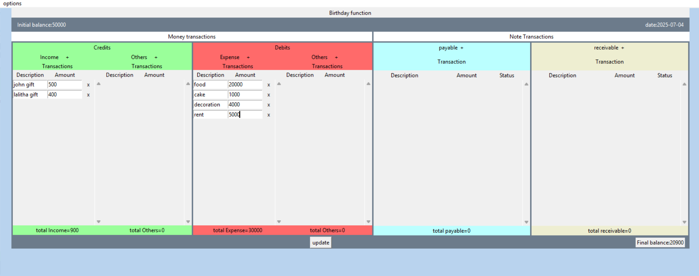
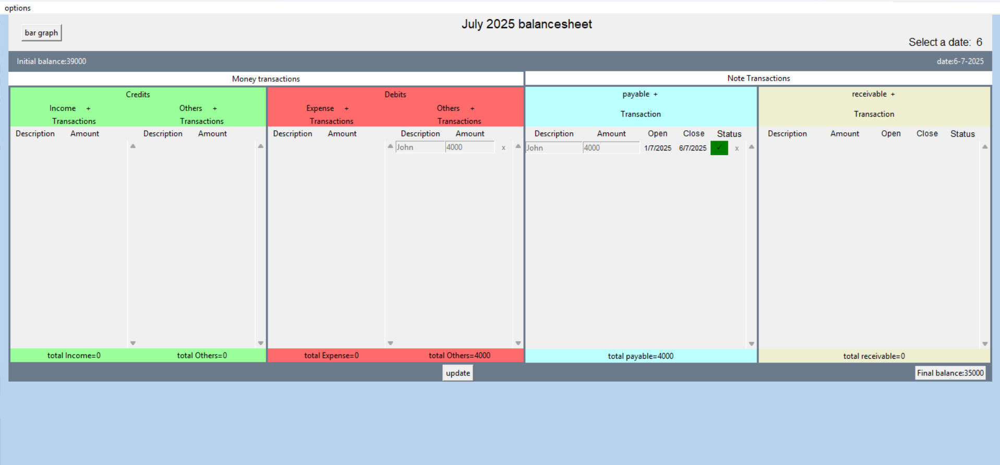

# 💼 Income & Expense Tracker - Coding Section

This application allows you to manage **income**, **expenses**, **payables**, and **receivables** using balance sheets.

## 🧾 Types of Balance Sheets

1. **Event Balance Sheet**
   - For tracking transactions related to specific **events**.

2. **Monthly Balance Sheet**
   - For tracking **monthly** financial activities.

---

## 📌 Application Usage

### Menu Options

- **New Event BalanceSheet**: Create a new event balance sheet.
- **New Month BalanceSheet**: Create a new monthly balance sheet.
- **Save**: Save the current balance sheet.
- **Open**: Load a previously saved balance sheet.
- **Exit**: Exit the application.

---

## 📋 Event Balance Sheet Functionality

- Displays four columns under "Money Transactions".
- Add transactions using the **+ button** near each section title.
- **Normal Transaction**:
  - Fields: `description`, `amount` (must be integer).
- **Notes Transaction**:
  - Fields: `description`, `amount` (must be integer).
  - Use `- button` under the status column to update the status.
  - Use `X (Del)` button to delete a transaction.
- **Update**: Click the **Update** button at the bottom to refresh the sheet with changes.

---

## 📅 Monthly Balance Sheet Functionality

- Same transaction layout as the event sheet.
- Additional Features:
  - **I/E Graph**: Displays an income vs expense bar graph.
  - **Receivable Chart**: Displays a pie chart of receivables.
  - **Payable Chart**: Displays a pie chart of payables.
  - Use the **date selector** to choose a particular balance sheet by date.
  - Use **Update** to apply and save changes.

---

## 🧩 Transaction Module Structure

### 1. `Transaction` Class
- Manages **normal money transactions**.
- Attributes:
  - `des`: Entry widget for description.
  - `amt`: Entry widget for amount.
- `load()`: Loads stored data from file.

### 2. `NotesTransaction` Class
- Manages **note transactions** in **event balance sheets**.
- Attributes:
  - `des`, `amt`: Entry widgets.
  - `opentrans`, `closetrans`: Lists of open and closed transactions.
- `statusbut`: Button to update transaction status.
- `load()`: Loads stored data.

### 3. `NotesTransactionDate` Class
- Manages **note transactions** in **monthly balance sheets**.
- Attributes:
  - `des`, `amt`: Entry widgets.
  - `opentrans`, `closetrans`: Lists of open and closed transactions.
  - `openlab`, `closelab`: Labels for open and close dates.
- `statusbut`: Updates status of the note.
- `load()`: Loads stored data.

---

## ✅ Notes

- All `amount` fields must contain integers only.
- Remember to use the **Update** button to reflect changes.
- Ensure your balance sheets are saved regularly using the **Save** option.

---

## 🛠 Tech Stack

- **Language**: Python
- **GUI**: Tkinter

## Contributors & Acknowledgments

- [Lokesh](https://github.com/Lokslucifer)
- Thanks to the Python, Tkinter and open-source communities for their libraries and inspiration.
